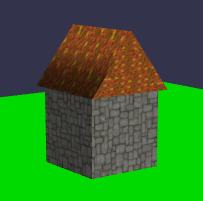

## 添加纹理

为了向网格添加颜色和纹理，我们向它们应用材质。基础材质就是这样创建的标准材质：

```javascript
const material = new BABYLON.StandardMaterial('name', scene);
```

创建绿色的纹理，设置到地面上：

```javascript
const groundMat = new BABYLON.StandardMaterial('groundMat');
groundMat.diffuseColor = new BABYLON.Color3(0, 1, 0);
ground.material = groundMat; //Place the material property of the ground
```

设置颜色可以向上面一样用 rgb，也可以调用一些基础的颜色：

```javascript
BABYLON.Color3.Red();
BABYLON.Color3.Green();
BABYLON.Color3.Blue();
BABYLON.Color3.Black();
BABYLON.Color3.White();
BABYLON.Color3.Purple();
BABYLON.Color3.Magenta();
BABYLON.Color3.Yellow();
BABYLON.Color3.Gray();
BABYLON.Color3.Teal();
```

现在来给屋顶也设置纹理：

```javascript
const roofMat = new BABYLON.StandardMaterial('roofMat');
roofMat.diffuseTexture = new BABYLON.Texture('https://assets.babylonjs.com/environments/roof.jpg', scene);
const boxMat = new BABYLON.StandardMaterial('boxMat');
boxMat.diffuseTexture = new BABYLON.Texture('https://www.babylonjs-playground.com/textures/floor.png');
```

纹理的第一个参数是要使用的图像的相对或绝对 URL。像往常一样，场景参数是可选的，并且默认为当前场景。

最后设置屋顶和方块的材料属性：

```javascript
roof.material = roofMat;
box.material = boxMat;
```

效果如下：


